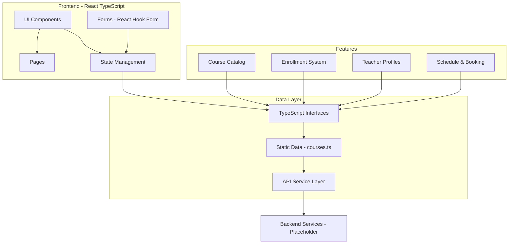
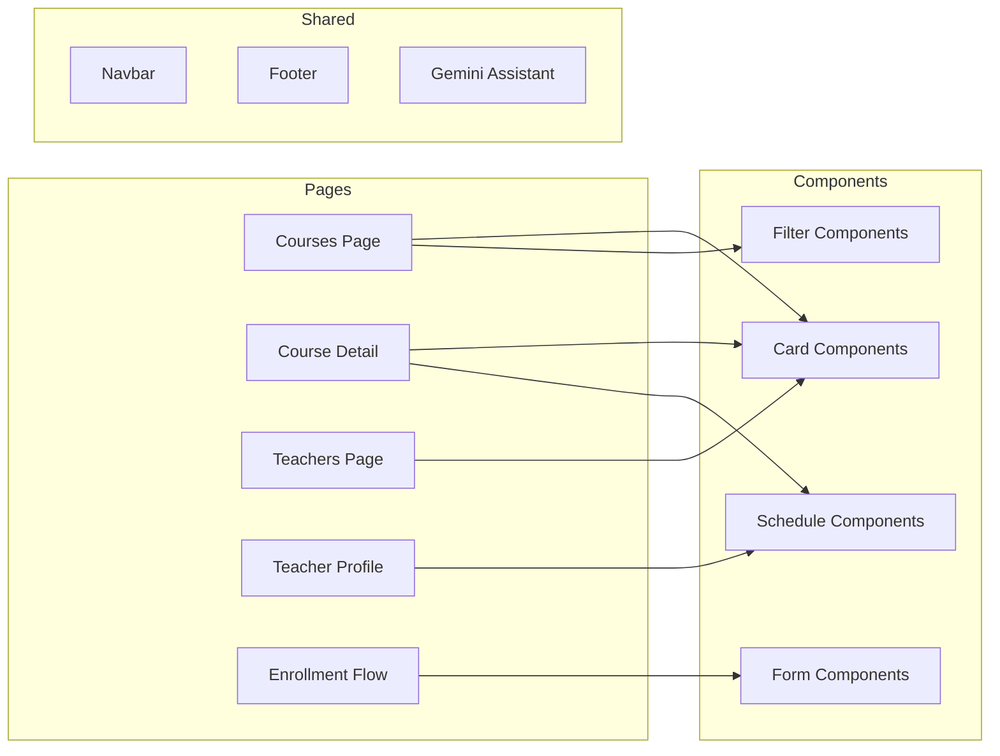

# Al Mo'assis Learning Center - Course Catalog System Architecture Plan

## 📋 Plan Version
- **Version:** 0.9
- **Date:** February 2025
- **Status:** Architecture Design
- **Author:** Kilo Code

---

## 🎯 Project Overview

### Current State
- The existing Courses page (`pages/Courses.tsx`) contains marketing content with Kids/Adults tabs
- Only basic descriptions and CTAs are implemented
- Missing: detailed course catalog, pricing plans, enrollment system, teacher profiles, schedules

### Target State
- Comprehensive course catalog with structured data models
- Detailed pricing plans with features comparison
- Multi-step enrollment system
- Teacher profiles with availability
- Schedule/booking system
- Dynamic course detail pages

---

## 🏗️ Architecture Overview

### System Architecture Diagram



### Component Architecture



---

## 📊 Data Models & Types

### 1. Core Types (`types.ts` extensions)

#### Course Type
```typescript
export interface Course {
  id: string;
  slug: string;
  title: string;
  shortDescription: string;
  fullDescription: string;
  ageGroup: 'KIDS' | 'ADULTS' | 'ALL';
  level: 'BEGINNER' | 'INTERMEDIATE' | 'ADVANCED';
  duration: string; // e.g., "3 months"
  sessionsPerWeek: number;
  sessionDuration: number; // minutes
  price: {
    monthly: number;
    quarterly: number;
    yearly?: number;
  };
  features: string[];
  curriculum: CourseModule[];
  teachers: string[]; // teacher IDs
  prerequisites: string[];
  whatYouWillLearn: string[];
  materialsIncluded: string[];
  thumbnailImage: string;
  galleryImages: string[];
  enrollmentStatus: 'OPEN' | 'CLOSED' | 'WAITLIST';
  rating: number;
  reviewCount: number;
  tags: string[];
}
```

#### Course Module
```typescript
export interface CourseModule {
  id: string;
  title: string;
  description: string;
  lessons: CourseLesson[];
  duration: string;
  objectives: string[];
}

export interface CourseLesson {
  id: string;
  title: string;
  type: 'VIDEO' | 'LIVE' | 'QUIZ' | 'READING';
  duration: number; // minutes
  description: string;
  resources?: string[];
}
```

#### Pricing Plan
```typescript
export interface PricingPlan {
  id: string;
  courseId: string;
  name: string;
  price: number;
  period: 'MONTHLY' | 'QUARTERLY' | 'YEARLY';
  discount?: number;
  features: {
    included: string[];
    excluded: string[];
  };
  popular?: boolean;
  ctaText: string;
  sessionInfo: {
    perWeek: number;
    duration: number; // minutes
  };
  bonusFeatures?: string[];
}
```

#### Teacher
```typescript
export interface Teacher {
  id: string;
  slug: string;
  name: string;
  title: string;
  photo: string;
  bio: string;
  specialties: string[]; // Tajweed, Nazira, Hifz, Arabic
  languages: string[];
  certifications: string[];
  experience: number; // years
  rating: number;
  reviewCount: number;
  teachingPhilosophy: string;
  availability: TeacherAvailability[];
  featured: boolean;
  gender: 'MALE' | 'FEMALE';
}
```

#### Teacher Availability
```typescript
export interface TeacherAvailability {
  dayOfWeek: number; // 0-6, Sunday-Saturday
  slots: TimeSlot[];
}

export interface TimeSlot {
  id: string;
  startTime: string; // "09:00"
  endTime: string; // "10:00"
  timezone: string;
  available: boolean;
}
```

#### Enrollment Form
```typescript
export interface EnrollmentData {
  // Step 1: Student Info
  studentInfo: {
    firstName: string;
    lastName: string;
    email: string;
    phone: string;
    age?: number;
    timezone: string;
  };
  
  // Step 2: Course Selection
  courseSelection: {
    courseId: string;
    planId: string;
    preferredTeacherId?: string;
    preferredDays: number[];
    preferredTimeSlot: string;
  };
  
  // Step 3: Parent/Guardian (for kids)
  parentInfo?: {
    firstName: string;
    lastName: string;
    email: string;
    phone: string;
    relationship: string;
  };
  
  // Step 4: Additional
  additionalInfo: {
    howFoundUs: string;
    specialRequirements?: string;
    agreedToTerms: boolean;
  };
}
```

---

## 📁 File Structure

```
src/
├── components/
│   ├── courses/
│   │   ├── CourseCard.tsx
│   │   ├── PricingCard.tsx
│   │   ├── CourseCurriculum.tsx
│   │   ├── CourseFilters.tsx
│   │   ├── CourseComparison.tsx
│   │   └── CourseDetail/
│   │       ├── CourseHero.tsx
│   │       ├── CourseOverview.tsx
│   │       ├── CoursePricing.tsx
│   │       ├── CourseReviews.tsx
│   │       └── RelatedCourses.tsx
│   ├── teachers/
│   │   ├── TeacherCard.tsx
│   │   ├── TeacherList.tsx
│   │   ├── TeacherFilters.tsx
│   │   └── TeacherProfile/
│   │       ├── TeacherBio.tsx
│   │       ├── TeacherSchedule.tsx
│   │       ├── TeacherReviews.tsx
│   │       └── BookTrialButton.tsx
│   ├── enrollment/
│   │   ├── EnrollmentWizard.tsx
│   │   ├── EnrollmentStep1.tsx
│   │   ├── EnrollmentStep2.tsx
│   │   ├── EnrollmentStep3.tsx
│   │   ├── EnrollmentStep4.tsx
│   │   └── EnrollmentConfirmation.tsx
│   ├── schedule/
│   │   ├── ScheduleGrid.tsx
│   │   ├── TimeSlotPicker.tsx
│   │   ├── CalendarExport.tsx
│   │   └── TimezoneSelector.tsx
│   └── ui/
│       ├── Modal.tsx
│       ├── Accordion.tsx
│       ├── Badge.tsx
│       ├── Button.tsx
│       ├── Card.tsx
│       └── Select.tsx
├── pages/
│   ├── Courses.tsx (enhanced)
│   ├── CourseDetail.tsx (new)
│   ├── Teachers.tsx (new)
│   ├── TeacherProfile.tsx (new)
│   └── Enrollment.tsx (new)
├── data/
│   ├── courses.ts (new)
│   ├── teachers.ts (new)
│   └── pricing.ts (new)
├── lib/
│   ├── api.ts (new)
│   ├── utils.ts
│   └── formatters.ts (new)
├── hooks/
│   ├── useCourses.ts (new)
│   ├── useTeachers.ts (new)
│   ├── useEnrollment.ts (new)
│   └── useSchedule.ts (new)
├── context/
│   └── CoursesContext.tsx (new)
└── types/
    └── index.ts (extended)
```

---

## 🚀 Implementation Phases

### Phase 1: Data Models & Foundation
**Duration:** 2-3 days

#### 1.1 TypeScript Interfaces
- [ ] Extend `types.ts` with all new interfaces
- [ ] Add proper TypeScript validation
- [ ] Export interfaces from centralized location

#### 1.2 Static Data Layer
- [ ] Create `data/courses.ts`
- [ ] Create `data/teachers.ts`
- [ ] Create `data/pricing.ts`
- [ ] Add comprehensive course data for Kids and Adults
- [ ] Add teacher profiles with availability

#### 1.3 API Service Layer (Placeholder)
- [ ] Create `lib/api.ts`
- [ ] Implement mock API functions
- [ ] Add error handling
- [ ] Add loading states

---

### Phase 2: UI Components
**Duration:** 4-5 days

#### 2.1 Course Components
- [ ] Create `CourseCard` - Course overview with thumbnail, title, price, features
- [ ] Create `PricingCard` - Plan details with comparison table
- [ ] Create `CourseCurriculum` - Accordion-style module breakdown
- [ ] Create `CourseFilters` - Age group, level, duration filters

#### 2.2 Teacher Components
- [ ] Create `TeacherCard` - Teacher photo, name, specialties, rating
- [ ] Create `TeacherList` - Grid layout for teacher directory
- [ ] Create `TeacherFilters` - Specialty, language, rating filters

#### 2.3 Schedule Components
- [ ] Create `ScheduleGrid` - Weekly calendar view
- [ ] Create `TimeSlotPicker` - Interactive slot selection
- [ ] Create `TimezoneSelector` - Timezone dropdown

#### 2.4 Form Components
- [ ] Create `Modal` - Reusable modal component
- [ ] Create `Accordion` - Expandable sections
- [ ] Enhance enrollment form components

---

### Phase 3: Pages Implementation
**Duration:** 3-4 days

#### 3.1 Courses Page (Enhanced)
- [ ] Add course filters sidebar/top bar
- [ ] Integrate CourseCard components
- [ ] Add course count and sorting options
- [ ] Implement search functionality
- [ ] Add "View Details" navigation

#### 3.2 Course Detail Page (New)
- [ ] Create dynamic route `/courses/:courseId`
- [ ] Implement CourseHero with course info
- [ ] Add CourseOverview with full description
- [ ] Add CourseCurriculum with all modules
- [ ] Add CoursePricing with plan comparison
- [ ] Add CourseReviews with ratings
- [ ] Add RelatedCourses section

#### 3.3 Teachers Page (New)
- [ ] Create route `/teachers`
- [ ] Implement TeacherList with filters
- [ ] Add search functionality
- [ ] Add sorting options (rating, experience)

#### 3.4 Teacher Profile Page (New)
- [ ] Create dynamic route `/teachers/:teacherId`
- [ ] Implement TeacherBio with full bio
- [ ] Add TeacherSchedule with availability
- [ ] Add TeacherReviews with testimonials
- [ ] Add BookTrialButton component

---

### Phase 4: Enrollment System
**Duration:** 3-4 days

#### 4.1 Multi-step Wizard
- [ ] Create EnrollmentWizard container
- [ ] Implement Step 1: Student Information
- [ ] Implement Step 2: Course Selection
- [ ] Implement Step 3: Parent/Guardian Info (conditional)
- [ ] Implement Step 4: Review & Submit
- [ ] Add progress indicator
- [ ] Add step navigation (next, back)

#### 4.2 Validation & State
- [ ] Add form validation (required fields, email format)
- [ ] Implement form state management
- [ ] Add save/load from localStorage
- [ ] Add confirmation step

#### 4.3 Confirmation
- [ ] Create enrollment confirmation view
- [ ] Generate enrollment ID
- [ ] Display next steps
- [ ] Add email notification placeholder

---

### Phase 5: Schedule & Booking
**Duration:** 2-3 days

#### 5.1 Schedule Grid
- [ ] Implement weekly calendar view
- [ ] Display available time slots
- [ ] Add timezone support
- [ ] Implement slot selection

#### 5.2 Booking Integration
- [ ] Add booking confirmation
- [ ] Generate booking ID
- [ ] Add to calendar functionality (Google, Outlook, iCal)
- [ ] Add booking confirmation email placeholder

---

### Phase 6: Integration & Polish
**Duration:** 3-4 days

#### 6.1 Routing
- [ ] Update `App.tsx` with new routes
- [ ] Add route parameters for dynamic pages
- [ ] Implement 404 handling
- [ ] Add route guards if needed

#### 6.2 Navigation Updates
- [ ] Update Navbar with new links
- [ ] Add breadcrumb navigation
- [ ] Add back buttons on detail pages

#### 6.3 Responsive Design
- [ ] Mobile-first course cards
- [ ] Tablet-friendly pricing tables
- [ ] Touch-friendly schedule grid
- [ ] Responsive enrollment wizard

#### 6.4 Animations
- [ ] Add hover effects on cards
- [ ] Add page transition animations
- [ ] Add loading skeletons
- [ ] Add success/error animations

---

### Phase 7: Testing & Optimization
**Duration:** 2-3 days

#### 7.1 Testing
- [ ] Unit tests for components
- [ ] Integration tests for forms
- [ ] Cross-browser testing
- [ ] Mobile responsiveness testing

#### 7.2 Performance
- [ ] Lazy load detail pages
- [ ] Image optimization
- [ ] Code splitting
- [ ] Memoization

#### 7.3 Accessibility
- [ ] ARIA labels for interactive elements
- [ ] Keyboard navigation
- [ ] Focus management
- [ ] Color contrast compliance

---

## 📝 Course Data Structure

### Kids Courses

#### 1. Nazira Starter
- **ID:** kids-nazira-starter
- **Title:** Qur'an Nazira with Easy Tajweed
- **Description:** Perfect for beginners. Learn to read the Qur'an with proper pronunciation and basic Tajweed rules in a fun, engaging environment.
- **Level:** BEGINNER
- **Duration:** 3 months
- **Sessions:** 2x per week, 30 min each
- **Price:** $150/month
- **Curriculum:**
  - Module 1: Arabic Alphabet & Sounds (2 weeks)
  - Module 2: Short Surahs (3 weeks)
  - Module 3: Basic Tajweed Rules (4 weeks)
  - Module 4: Practice & Review (3 weeks)
- **Features:** Game-based learning, printable worksheets, progress tracking

#### 2. Tajweed Fundamentals
- **ID:** kids-tajweed-fundamentals
- **Title:** Tajweed Fundamentals
- **Description:** Build on existing knowledge with proper Tajweed rules. Perfect for kids who can read but want to improve.
- **Level:** INTERMEDIATE
- **Duration:** 6 months
- **Sessions:** 2x per week, 45 min each
- **Price:** $175/month
- **Curriculum:**
  - Module 1: Makharij al-Huruf (3 weeks)
  - Module 2: Sifaat al-Huruf (4 weeks)
  - Module 3: Noon Sakinah Rules (3 weeks)
  - Module 4: Meem Sakinah Rules (3 weeks)
  - Module 5: Lam & Ra Rules (3 weeks)
  - Module 6: Advanced Practice (4 weeks)

#### 3. Advanced Tajweed & Hifz
- **ID:** kids-tajweed-advanced
- **Title:** Advanced Tajweed & Memorization
- **Description:** Master advanced Tajweed rules and begin memorizing the Qur'an with effective techniques.
- **Level:** ADVANCED
- **Duration:** 12 months
- **Sessions:** 3x per week, 45 min each
- **Price:** $200/month
- **Curriculum:**
  - Module 1: Advanced Tajweed Review (4 weeks)
  - Module 2: Memorization Techniques (8 weeks)
  - Module 3: Hifz Surah Al-Kahf (4 weeks)
  - Module 4: Hifz Last 10 Surahs (4 weeks)
  - Module 5: Review & Assessment (4 weeks)

### Adults Courses

#### 1. Beginner Nazira
- **ID:** adults-nazira-beginner
- **Title:** Qur'an Reading for Adults
- **Description:** Start your Qur'an reading journey from scratch or refresh your skills. Designed for adult learners with busy schedules.
- **Level:** BEGINNER
- **Duration:** 4 months
- **Sessions:** 2x per week, 45 min each
- **Price:** $180/month
- **Curriculum:**
  - Module 1: Alphabet & Basic Sounds (3 weeks)
  - Module 2: Connecting Letters (4 weeks)
  - Module 3: Short Surahs Practice (4 weeks)
  - Module 4: Building Fluency (5 weeks)

#### 2. Tajweed Mastery
- **ID:** adults-tajweed-mastery
- **Title:** Tajweed Mastery
- **Description:** Comprehensive Tajweed course for adults who want to recite with proper rules and beautiful voice.
- **Level:** INTERMEDIATE
- **Duration:** 6 months
- **Sessions:** 2x per week, 60 min each
- **Price:** $200/month
- **Curriculum:**
  - Module 1: Makharij al-Huruf (4 weeks)
  - Module 2: Sifaat al-Huruf (4 weeks)
  - Module 3: Idgham Rules (4 weeks)
  - Module 4: Ghunna & Izhar Rules (4 weeks)
  - Module 5: Qalqalah & Madd Rules (4 weeks)
  - Module 6: Complete Recitation Practice (4 weeks)

#### 3. Hifz Support
- **ID:** adults-hifz-support
- **Title:** Memorization Support Program
- **Description:** Get personalized support for memorizing the Qur'an. Perfect for those who have started but need guidance.
- **Level:** INTERMEDIATE
- **Duration:** 12 months
- **Sessions:** 2x per week, 60 min each
- **Price:** $250/month
- **Features:** Personalized memorization plan, daily check-ins, review sessions

---

## 👨‍🏫 Teacher Data Structure

### Teacher Profile Template
```typescript
{
  id: "teacher-1",
  slug: "dr-asim-khwaja",
  name: "Dr. Asim Khwaja",
  title: "Senior Quran Teacher",
  photo: "/images/teachers/asim-khwaja.jpg",
  bio: "Dr. Asim Khwaja has been teaching the Qur'an for over 15 years...",
  specialties: ["Tajweed", "Nazira", "Hifz"],
  languages: ["English", "Urdu", "Arabic"],
  certifications: ["Al-Azhar University", "Tajweed Certification"],
  experience: 15,
  rating: 4.9,
  reviewCount: 245,
  teachingPhilosophy: "I believe in creating a supportive environment...",
  gender: "MALE",
  featured: true,
  availability: [
    {
      dayOfWeek: 1,
      slots: [
        { id: "slot-1", startTime: "09:00", endTime: "10:00", timezone: "UTC", available: true }
      ]
    }
  ]
}
```

---

## 💰 Pricing Plans

### Kids Plans

| Feature | Starter | Standard | Premium |
|---------|---------|----------|---------|
| Price/Month | $100 | $150 | $200 |
| Sessions/Week | 1 | 2 | 3 |
| Session Duration | 30 min | 30 min | 45 min |
| 1-on-1 Sessions | ✅ | ✅ | ✅ |
| Progress Reports | Monthly | Weekly | Daily |
| Game-Based Learning | ✅ | ✅ | ✅ |
| Recorded Sessions | ❌ | ✅ | ✅ |
| Parent Portal | ❌ | ✅ | ✅ |
| Priority Scheduling | ❌ | ❌ | ✅ |
| Bonus: Arabic Basics | ❌ | ❌ | ✅ |

### Adults Plans

| Feature | Essential | Standard | Intensive |
|---------|-----------|----------|-----------|
| Price/Month | $150 | $200 | $300 |
| Sessions/Week | 1 | 2 | 3 |
| Session Duration | 45 min | 60 min | 60 min |
| 1-on-1 Sessions | ✅ | ✅ | ✅ |
| Tajweed Focus | Basic | Full | Advanced |
| Recorded Sessions | ❌ | ✅ | ✅ |
| Flexible Scheduling | ❌ | ✅ | ✅ |
| Female Teacher Option | ❌ | ✅ | ✅ |
| Hifz Support | ❌ | ❌ | ✅ |

---

## 🎨 Design Guidelines

### Color Scheme
```css
:root {
  --primary-green: #1B5E20;
  --primary-green-light: #2E7D32;
  --gold: #FFD700;
  --gold-light: #FFECB3;
  --cream: #FAFAFA;
  --text-dark: #1a1a1a;
  --text-light: #666666;
  --white: #ffffff;
  --success: #4CAF50;
  --warning: #FFC107;
  --error: #F44336;
}
```

### Typography
- **Headings:** Space Grotesk
- **Body:** Poppins
- **Arabic Text:** Amiri

### Component States
- **Default:** Primary green background, white text
- **Hover:** Slightly lighter green, subtle shadow
- **Active:** Darker green, pressed effect
- **Disabled:** Grayed out, no pointer events
- **Loading:** Skeleton shimmer effect
- **Success:** Green checkmark, confirmation message
- **Error:** Red border, error message

---

## 🔧 API Endpoints (Placeholder)

### Courses
```
GET /api/courses
GET /api/courses/:id
GET /api/courses/:id/curriculum
GET /api/courses/:id/pricing
GET /api/courses/:id/reviews
```

### Teachers
```
GET /api/teachers
GET /api/teachers/:id
GET /api/teachers/:id/availability
GET /api/teachers/:id/reviews
```

### Schedule
```
GET /api/schedule/:teacherId
POST /api/schedule/book
DELETE /api/schedule/:bookingId
```

### Enrollment
```
POST /api/enrollment
GET /api/enrollment/:id
POST /api/enrollment/:id/confirm
```

---

## 📱 Responsive Breakpoints

### Mobile (< 480px)
- Single column layout
- Hidden filters (hamburger menu)
- Stacked pricing cards
- Full-width buttons
- Collapsed schedule grid

### Tablet (480px - 768px)
- Two column grid
- Visible filters sidebar
- Side-by-side pricing comparison
- Horizontal schedule view

### Desktop (> 768px)
- Three column grid
- Full filter sidebar
- Detailed pricing table
- Weekly calendar view

---

## ✅ Success Criteria

### Functional Requirements
- [ ] Users can browse all courses with filters
- [ ] Users can view detailed course information
- [ ] Users can compare pricing plans
- [ ] Users can view teacher profiles
- [ ] Users can check teacher availability
- [ ] Users can enroll in courses
- [ ] Users can select preferred schedule
- [ ] Users receive confirmation

### Non-Functional Requirements
- [ ] Page load time < 3 seconds
- [ ] Mobile responsive design
- [ ] Accessibility compliance (WCAG 2.1)
- [ ] Cross-browser compatibility
- [ ] SEO optimized pages

---

## 🚧 Risks & Mitigations

| Risk | Impact | Mitigation |
|------|--------|------------|
| API not ready | High | Use mock data and placeholder API |
| Complex forms | Medium | Break into steps, add validation |
| Schedule conflicts | Medium | Add buffer time, show real-time availability |
| Performance issues | Medium | Lazy loading, code splitting |
| Mobile UX | Low | Mobile-first design, touch-friendly |

---

## 📅 Timeline Summary

| Phase | Duration | Deliverables |
|-------|----------|--------------|
| Phase 1: Data Models | 2-3 days | Types, data, API layer |
| Phase 2: UI Components | 4-5 days | Course, Teacher, Schedule, Form components |
| Phase 3: Pages | 3-4 days | Courses, Detail, Teachers, Profile pages |
| Phase 4: Enrollment | 3-4 days | Multi-step wizard, confirmation |
| Phase 5: Schedule | 2-3 days | Schedule grid, booking |
| Phase 6: Integration | 3-4 days | Routing, polish, responsive |
| Phase 7: Testing | 2-3 days | Unit tests, optimization |
| **Total** | **19-26 days** | **Complete course catalog system** |

---

*Document Version: 0.9*
*Last Updated: February 2025*
*Status: Ready for Review*
